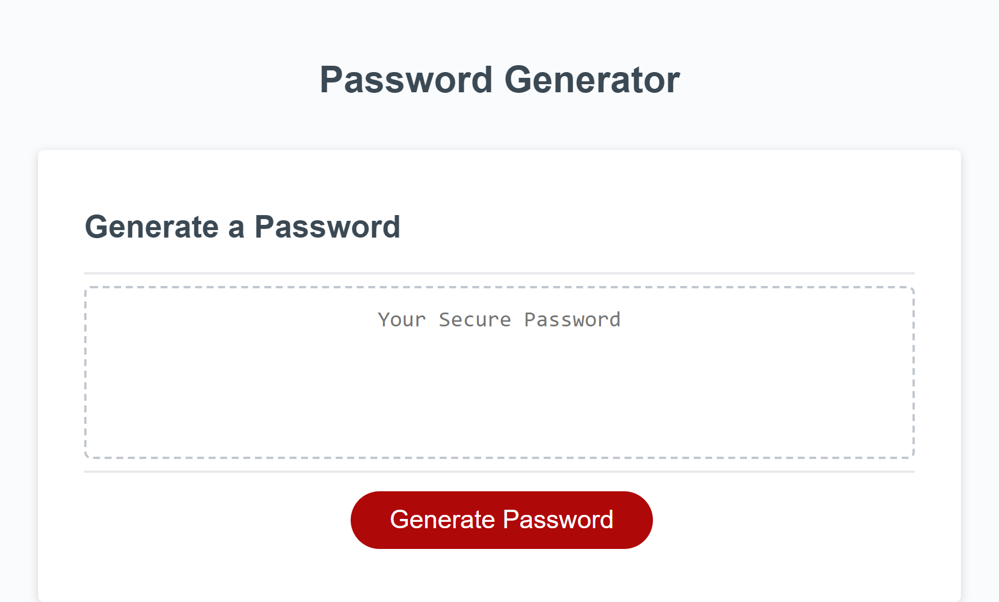

# Password Generator

## Description

This project was design for students to implement their newfound JavaScript skills. Working off starter code, we had to pseudo-code what was given, to gain a better understanding of what needed to be done. The end result is an application that is used to generate a random password based on criteria the user selected.

## Motivation

Here is a list of my motivations for this project!

- Gain a better understanding for functions, if statements, and computer logic
- Develop a sense for how to consolidate and clean up code using methods and functions
- Learn how to properly use a "for loop" to truly randomize a string based on its inputs
- To present an application that myself and others can use to create strong passwords for safety

## Deployed Webpage

[Click here to go to my fully deployed application!](https://erikbenedict.github.io/password-generator/)

## Screenshots

## Author

Erik Benedict  
erik.r.benedict@gmail.com
